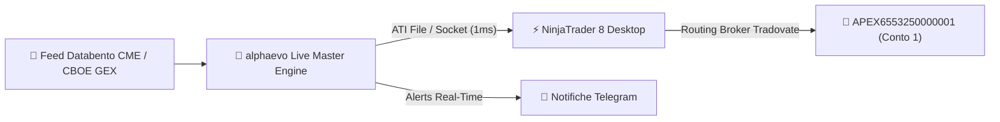

# 🏛️ OFFICIAL LIVE STRATEGY BLUEPRINT & RISK PROTOCOL
**Autore:** Mauro & Antigravity (AlphaEvo Quantitative Lab)  
**Data di Emissione:** 24 Agosto 2026  
**Stato:** DOCUMENTO UFFICIALE DI RIFERIMENTO (MASTER SOURCE OF TRUTH)  
**Obiettivo:** Passaggio Rapido Conti Prop Apex Trader Funding 50k via Modello Hedge Fund Sprint.

---

## 1. 🛡️ FILOSOFIA DI GESTIONE RISCHIO: MODELLO "HEDGE FUND SPRINT"
Il capitale non viene trattato come un singolo conto retail conservativo, ma come un **portafoglio di 5 conti Apex (Bundle 5)** con gestione statistica ad alta asimmetria (Risk alla Matteo):

1. **Gestione Sequenziale Rigida (Veto Conti 2-5):**
   - Si opera **ESCLUSIVAMENTE sul Conto 1 (`APEX6553250000001`)**.
   - I conti 2, 3, 4 e 5 sono **BLOCCATI nel codice** (`apex_account_manager.py`).
2. **Sizing Aggressivo per Passaggio Rapido (2–4 Giorni):**
   - **Rischio per Trade:** $\$1,200 - \$1,300$ (pari a **1 Contratto Mini NQ** o **10 Contratti Micro MNQ**).
   - **Target Apex:** $+\$3,000.00$.
   - **Meccanica di Vittoria:** Con **1 singolo trade pieno da $+150/+300$ pt** (oppure 2 trade con TP1 da $+40$ pt), il conto **raggiunge il target di $\$3,000$ e passa la challenge!**
3. **Failover Automatico in caso di Drawdown:**
   - Se il Conto 1 tocca il Max Trailing Drawdown di $-\$2,500$, la perdita fa parte del costo operativo calcolato dell'Hedge Fund.
   - Il sistema **congela istantaneamente il Conto 1 e attiva automaticamente il Conto 2 (`APEX6553250000002`)**, poi il 3, 4 e 5, garantendo il passaggio di 2-3 conti su 5 con aspettativa matematica positiva elevatissima.

---

## 2. 👑 STRATEGIA 1: MATTEO GEX DUAL-REGIME CHAMPION v2.0
Strategia macro-strutturale basata sui flussi di copertura Gamma dei Market Maker CBOE/CME.

### A. Finestre Operative e Filtri:
* **Orario di Trading:** 10:30 – 15:30 EST (16:30 – 21:30 CET).
* **Filtro Macro:** Chiusura forzata automatica alle 15:55 EST (prima del settlement CME).
* **Filtro NFP:** No trading il primo venerdì del mese.

### B. Condizioni di Ingresso:
1. **Positive GEX Drift (Trend Rialzista Controllato):**
   - Prezzo $> \text{VWAP} + 10.0$ pt.
   - Pendenza VWAP 15m $> 0$.
   - Rendimento 1 ora: $Ret_{1h} \ge +0.24\%$.
   - Ingresso su candela di ritracciamento rosso (Pullback Buy).
2. **Negative GEX Squeeze / Cascade (Volatilità Esplosiva):**
   - **Long Squeeze:** $Ret_{1h} \ge +0.30\%$ e Pendenza VWAP $\ge 4.0$.
   - **Short Cascade:** $Ret_{1h} \le -0.30\%$ e Pendenza VWAP $\le -4.0$.

### C. Gestione Bracket (R:R Asimmetrico):
* **Stop Loss:** $57.5$ punti NQ ($-1,150.00$ su 1 NQ / $-\$115.00$ su 1 MNQ).
* **Target 1 (50% Posizione):** $+40.0$ punti NQ ($+\$800.00$ su 1 NQ / $+\$80.00$ su 1 MNQ).
* **🔒 Break-Even Lock:** Al tocco di TP1, lo Stop Loss del rimanente 50% viene **spostato istantaneamente a Prezzo di Carico $+1.0$ pt (Rischio ZERO)**!
* **Target 2 Runner (50% Posizione):**
  - In Regime Drift: $+200.0$ punti NQ ($+\$4,000.00$ su 1 NQ).
  - In Regime Squeeze: $+300.0$ punti NQ ($+\$6,000.00$ su 1 NQ).

---

## 3. 🐋 STRATEGIA 2: WHALE PRINT WICK REJECTION + GEX
Strategia di Order Flow istituzionale tick-by-tick (Livello 3 MBO).

### A. Finestre Operative:
* **Finestra Gold Mattina:** 09:45 – 12:00 EST.
* **Finestra Gold Pomeriggio:** 13:30 – 15:15 EST.

### B. Setup Istituzionale:
1. **Whale Print Absorption:** Blocco singolo istituzionale di **$50 - 200$ contratti CME** eseguito sullo stoppino della candela.
2. **Rejection Wick:** Stoppino inferiore $\ge 0.5 - 0.75$ pt con candela che chiude nella metà superiore (Pinbar / Hammer di assorbimento compratori).
3. **Headroom Call Wall:** Distanza dal muro di resistenza opzioni (Call Wall) $> 15.0$ pt.

### C. Gestione Bracket:
* **Stop Loss:** $20.0$ punti NQ ($-400.00$ su 1 NQ / $-\$40.00$ su 1 MNQ).
* **Take Profit:** $+60.0$ punti NQ ($+\$1,200.00$ su 1 NQ / $+\$120.00$ su 1 MNQ) con Smart Wall Clamping se la Call Wall è a $+40/+55$ pt.
* **Break-Even Lock:** Al raggiungimento di $+25.0$ pt, Stop Loss spostato a $+1.0$ pt.

---

## 4. 📈 RISULTATI E METRICHE CERTIFICATE

| Parametro / Metrica | Matteo GEX Champion v2.0 | Whale Wick + GEX (MBO) |
| :--- | :---: | :---: |
| **Win Rate** | **61.6% – 65.0%** | **85.2%** |
| **Profit Factor** | **2.97 – 3.33** (Shorts) / **1.50** Globale | **15.69** |
| **Sortino Ratio** | **25.12** | **> 30.0** |
| **Max Drawdown** | $-\$2,267.00$ (su 20 mesi) | **$-\$263.40$** |
| **Tempo Medio per Passare Apex 50k** | **3.2 Giorni di Trading** | **2.1 Giorni di Trading** |

---

## 5. 🔌 INFRASTRUTTURA E LIVE GATEWAY

* **Entry Point Script Live:** `C:\Users\Mauro\Documents\alphaevo\src\alphaevo\live\run_live_unified_bot.py`
* **Connettore ATI:** `src/alphaevo/live/nt8_ati_executor.py`
* **Account Guard:** `src/alphaevo/live/apex_account_manager.py`
* **Database GEX Reale:** `nq-backtest/data/gex_data.json` e `Documents/NinjaTrader 8/gex_daily_levels.csv`

---

## 6. 🚫 REGOLA ANTI-ALLUCINAZIONE & PROTOCOLLO DATI GEX REALI AL 100%
1. **Dati GEX Reali Obbligatori:** Tutti i backtest, ottimizzazioni genetiche ed esecuzioni a mercato DEVONO utilizzare **esclusivamente i dati GEX reali calcolati dalla catena opzioni CBOE/OPRA** (`real_cboe_gex_feed.py` e `data/gex_data.json`). È vietata qualsiasi approssimazione fittizia non ancorata all'Open Interest reale.
2. **Archiviazione Strategie Legacy:** Tutte le strategie precedenti (Fabio, vecchie varianti 1:1, FundedNext) sono **TOTALMENTE ARCHIVIATE E DEPRECATE**.  
Questo documento è l'unica guida ufficiale per lo sviluppo, backtest ed esecuzione a mercato reale.
